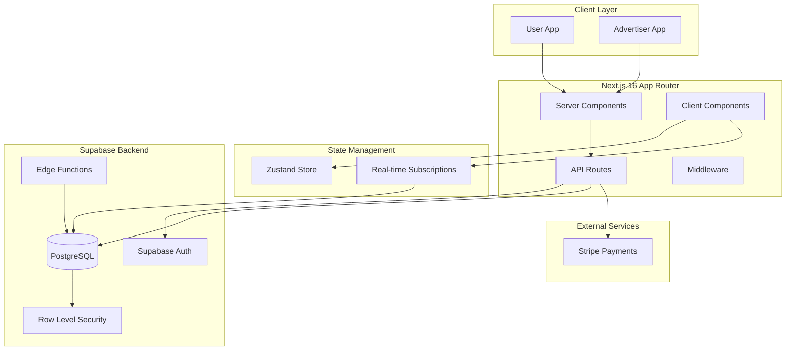
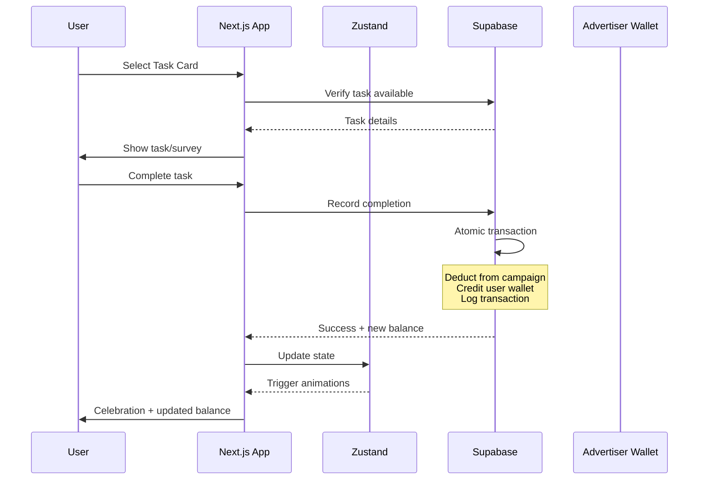

# Design Document

## Overview

A gamified task/survey completion platform built with Next.js 16, Supabase, and Framer Motion. The system consists of two main portals: a user-facing reward app with game-like aesthetics and an advertiser dashboard for campaign management. The architecture leverages Supabase for authentication, database, and real-time subscriptions, with Zustand for client-side state management.

## Architecture



### System Flow



## Components and Interfaces

### Directory Structure

```
app/
├── (auth)/
│   ├── login/page.tsx
│   ├── register/page.tsx
│   └── layout.tsx
├── (user)/
│   ├── dashboard/page.tsx
│   ├── task/[id]/page.tsx
│   ├── wallet/page.tsx
│   └── layout.tsx
├── (advertiser)/
│   ├── dashboard/page.tsx
│   ├── campaigns/
│   │   ├── page.tsx
│   │   ├── new/page.tsx
│   │   └── [id]/page.tsx
│   ├── wallet/page.tsx
│   └── layout.tsx
├── api/
│   ├── tasks/
│   │   ├── complete/route.ts
│   │   └── route.ts
│   ├── campaigns/route.ts
│   ├── payments/
│   │   ├── create-intent/route.ts
│   │   └── webhook/route.ts
│   └── auth/callback/route.ts
└── layout.tsx

components/
├── ui/
│   ├── Button.tsx
│   ├── Card.tsx
│   ├── Input.tsx
│   ├── Modal.tsx
│   └── Badge.tsx
├── user/
│   ├── TaskCard.tsx
│   ├── TaskGrid.tsx
│   ├── CategoryScroll.tsx
│   ├── WalletHeader.tsx
│   ├── Mascot.tsx
│   ├── CooldownTimer.tsx
│   ├── RewardAnimation.tsx
│   └── ConfettiCelebration.tsx
├── advertiser/
│   ├── CampaignCard.tsx
│   ├── CampaignWizard.tsx
│   ├── BudgetProgress.tsx
│   ├── AnalyticsChart.tsx
│   └── WalletPanel.tsx
└── shared/
    ├── Header.tsx
    ├── Navigation.tsx
    └── LoadingSkeleton.tsx

lib/
├── supabase/
│   ├── client.ts
│   ├── server.ts
│   └── middleware.ts
├── stores/
│   ├── userStore.ts
│   ├── taskStore.ts
│   └── advertiserStore.ts
├── utils/
│   ├── formatters.ts
│   ├── validators.ts
│   └── animations.ts
└── types/
    └── index.ts
```

### Core Component Interfaces

```typescript
// TaskCard Component
interface TaskCardProps {
  task: Task;
  cooldownEnd: Date | null;
  onSelect: (taskId: string) => void;
  isAvailable: boolean;
}

// CategoryScroll Component
interface CategoryScrollProps {
  categories: Category[];
  selectedCategory: string | null;
  onSelect: (categoryId: string) => void;
}

// Mascot Component
interface MascotProps {
  state: 'idle' | 'celebrating' | 'pointing' | 'sleeping';
  onAnimationComplete?: () => void;
}

// CooldownTimer Component
interface CooldownTimerProps {
  endTime: Date;
  onExpire: () => void;
}

// CampaignWizard Component
interface CampaignWizardProps {
  onComplete: (campaign: CampaignDraft) => void;
  onCancel: () => void;
  advertiserBalance: number;
}

// CampaignCard Component
interface CampaignCardProps {
  campaign: Campaign;
  onPause: (id: string) => void;
  onAddFunds: (id: string) => void;
  onViewAnalytics: (id: string) => void;
}
```

### Zustand Store Interfaces

```typescript
// User Store
interface UserStore {
  user: User | null;
  walletBalance: number;
  cooldowns: Map<string, Date>;
  setUser: (user: User) => void;
  updateBalance: (amount: number) => void;
  setCooldown: (taskId: string, endTime: Date) => void;
  clearCooldown: (taskId: string) => void;
  isTaskOnCooldown: (taskId: string) => boolean;
}

// Task Store
interface TaskStore {
  tasks: Task[];
  categories: Category[];
  selectedCategory: string | null;
  isLoading: boolean;
  setTasks: (tasks: Task[]) => void;
  setSelectedCategory: (categoryId: string | null) => void;
  getAvailableTasks: () => Task[];
}

// Advertiser Store
interface AdvertiserStore {
  advertiser: Advertiser | null;
  campaigns: Campaign[];
  walletBalance: number;
  setAdvertiser: (advertiser: Advertiser) => void;
  setCampaigns: (campaigns: Campaign[]) => void;
  updateCampaign: (id: string, updates: Partial<Campaign>) => void;
  updateBalance: (amount: number) => void;
}
```

## Data Models

### Supabase Database Schema

```sql
-- Users table (extends Supabase auth.users)
CREATE TABLE profiles (
  id UUID PRIMARY KEY REFERENCES auth.users(id) ON DELETE CASCADE,
  email TEXT NOT NULL,
  display_name TEXT,
  avatar_url TEXT,
  role TEXT NOT NULL DEFAULT 'user' CHECK (role IN ('user', 'advertiser', 'admin')),
  wallet_balance DECIMAL(10,4) NOT NULL DEFAULT 0,
  created_at TIMESTAMPTZ NOT NULL DEFAULT NOW(),
  updated_at TIMESTAMPTZ NOT NULL DEFAULT NOW()
);

-- Categories for task filtering
CREATE TABLE categories (
  id UUID PRIMARY KEY DEFAULT gen_random_uuid(),
  name TEXT NOT NULL,
  icon_url TEXT,
  color TEXT NOT NULL,
  sort_order INTEGER NOT NULL DEFAULT 0,
  created_at TIMESTAMPTZ NOT NULL DEFAULT NOW()
);

-- Campaigns (advertiser-created tasks)
CREATE TABLE campaigns (
  id UUID PRIMARY KEY DEFAULT gen_random_uuid(),
  advertiser_id UUID NOT NULL REFERENCES profiles(id) ON DELETE CASCADE,
  category_id UUID REFERENCES categories(id),
  title TEXT NOT NULL,
  description TEXT,
  thumbnail_url TEXT,
  campaign_type TEXT NOT NULL CHECK (campaign_type IN ('survey', 'video', 'task', 'app_download', 'website_visit')),
  total_budget DECIMAL(10,4) NOT NULL,
  spent_amount DECIMAL(10,4) NOT NULL DEFAULT 0,
  cost_per_action DECIMAL(10,4) NOT NULL,
  target_completions INTEGER,
  completed_count INTEGER NOT NULL DEFAULT 0,
  cooldown_seconds INTEGER NOT NULL DEFAULT 3600,
  estimated_duration_minutes INTEGER NOT NULL DEFAULT 5,
  difficulty TEXT NOT NULL DEFAULT 'easy' CHECK (difficulty IN ('easy', 'medium', 'hard')),
  status TEXT NOT NULL DEFAULT 'active' CHECK (status IN ('draft', 'active', 'paused', 'depleted', 'completed')),
  gradient_start TEXT NOT NULL DEFAULT '#8B7ECC',
  gradient_end TEXT NOT NULL DEFAULT '#A99DD8',
  created_at TIMESTAMPTZ NOT NULL DEFAULT NOW(),
  updated_at TIMESTAMPTZ NOT NULL DEFAULT NOW(),
  expires_at TIMESTAMPTZ
);

-- User task completions and cooldowns
CREATE TABLE task_completions (
  id UUID PRIMARY KEY DEFAULT gen_random_uuid(),
  user_id UUID NOT NULL REFERENCES profiles(id) ON DELETE CASCADE,
  campaign_id UUID NOT NULL REFERENCES campaigns(id) ON DELETE CASCADE,
  completed_at TIMESTAMPTZ NOT NULL DEFAULT NOW(),
  cooldown_ends_at TIMESTAMPTZ NOT NULL,
  reward_amount DECIMAL(10,4) NOT NULL,
  ip_address INET,
  device_fingerprint TEXT,
  UNIQUE(user_id, campaign_id, completed_at)
);

-- Transactions for audit trail
CREATE TABLE transactions (
  id UUID PRIMARY KEY DEFAULT gen_random_uuid(),
  user_id UUID REFERENCES profiles(id),
  campaign_id UUID REFERENCES campaigns(id),
  transaction_type TEXT NOT NULL CHECK (transaction_type IN ('deposit', 'withdrawal', 'reward', 'campaign_spend', 'commission')),
  amount DECIMAL(10,4) NOT NULL,
  balance_after DECIMAL(10,4) NOT NULL,
  description TEXT,
  metadata JSONB,
  created_at TIMESTAMPTZ NOT NULL DEFAULT NOW()
);

-- Advertiser deposits
CREATE TABLE deposits (
  id UUID PRIMARY KEY DEFAULT gen_random_uuid(),
  advertiser_id UUID NOT NULL REFERENCES profiles(id) ON DELETE CASCADE,
  amount DECIMAL(10,4) NOT NULL,
  stripe_payment_intent_id TEXT,
  status TEXT NOT NULL DEFAULT 'pending' CHECK (status IN ('pending', 'completed', 'failed')),
  created_at TIMESTAMPTZ NOT NULL DEFAULT NOW()
);

-- Indexes for performance
CREATE INDEX idx_campaigns_status ON campaigns(status);
CREATE INDEX idx_campaigns_advertiser ON campaigns(advertiser_id);
CREATE INDEX idx_completions_user ON task_completions(user_id);
CREATE INDEX idx_completions_cooldown ON task_completions(user_id, campaign_id, cooldown_ends_at);
CREATE INDEX idx_transactions_user ON transactions(user_id);
```

### TypeScript Types

```typescript
interface User {
  id: string;
  email: string;
  displayName: string | null;
  avatarUrl: string | null;
  role: 'user' | 'advertiser' | 'admin';
  walletBalance: number;
  createdAt: Date;
}

interface Category {
  id: string;
  name: string;
  iconUrl: string | null;
  color: string;
  sortOrder: number;
}

interface Campaign {
  id: string;
  advertiserId: string;
  categoryId: string | null;
  title: string;
  description: string | null;
  thumbnailUrl: string | null;
  campaignType: 'survey' | 'video' | 'task' | 'app_download' | 'website_visit';
  totalBudget: number;
  spentAmount: number;
  costPerAction: number;
  targetCompletions: number | null;
  completedCount: number;
  cooldownSeconds: number;
  estimatedDurationMinutes: number;
  difficulty: 'easy' | 'medium' | 'hard';
  status: 'draft' | 'active' | 'paused' | 'depleted' | 'completed';
  gradientStart: string;
  gradientEnd: string;
  createdAt: Date;
  expiresAt: Date | null;
}

interface Task extends Campaign {
  userCooldownEndsAt: Date | null;
  isAvailable: boolean;
  userRating: number;
}

interface TaskCompletion {
  id: string;
  userId: string;
  campaignId: string;
  completedAt: Date;
  cooldownEndsAt: Date;
  rewardAmount: number;
}

interface Transaction {
  id: string;
  userId: string | null;
  campaignId: string | null;
  transactionType: 'deposit' | 'withdrawal' | 'reward' | 'campaign_spend' | 'commission';
  amount: number;
  balanceAfter: number;
  description: string | null;
  createdAt: Date;
}

interface CampaignDraft {
  title: string;
  description: string;
  categoryId: string;
  campaignType: Campaign['campaignType'];
  totalBudget: number;
  costPerAction: number;
  cooldownSeconds: number;
  estimatedDurationMinutes: number;
  thumbnailUrl?: string;
}
```


## Correctness Properties

*A property is a characteristic or behavior that should hold true across all valid executions of a system-essentially, a formal statement about what the system should do. Properties serve as the bridge between human-readable specifications and machine-verifiable correctness guarantees.*

Based on the prework analysis, the following properties have been identified. Redundant properties have been consolidated where one property implies another.

### Property 1: User Registration Initializes Correct State

*For any* valid registration credentials, when a user account is created, the resulting profile SHALL have role='user' and wallet_balance=0.

**Validates: Requirements 1.1**

### Property 2: Task Card Rendering Contains Required Fields

*For any* task/campaign, when rendered as a card, the output SHALL contain the title, reward amount (CPA * 0.75), description, and rating.

**Validates: Requirements 3.1**

### Property 3: Cooldown State Determines Task Availability

*For any* task and user, the task is available if and only if there is no completion record where cooldown_ends_at > current_time.

**Validates: Requirements 3.3, 5.3, 5.5**

### Property 4: Task Completion Credits Correct Reward

*For any* task completion, the user wallet balance SHALL increase by exactly (CPA * 0.75), the campaign spent_amount SHALL increase by CPA, and a transaction record SHALL be created with all amounts.

**Validates: Requirements 4.2, 10.1, 11.1, 11.2, 11.3**

### Property 5: Cooldown Timestamp Calculation

*For any* task completion, the cooldown_ends_at timestamp SHALL equal completion_time + campaign.cooldown_seconds.

**Validates: Requirements 4.4, 5.1**

### Property 6: Advertiser Registration Initializes Correct State

*For any* valid advertiser registration, the resulting profile SHALL have role='advertiser' and wallet_balance=0.

**Validates: Requirements 7.1, 7.3**

### Property 7: Role-Based Route Authorization

*For any* request to an advertiser-only route, access SHALL be granted if and only if the authenticated user has role='advertiser' or role='admin'.

**Validates: Requirements 7.4**

### Property 8: Campaign Card Displays Required Metrics

*For any* campaign, the rendered card SHALL display status, budget progress (spent/total), and completion count.

**Validates: Requirements 8.2**

### Property 9: Budget Warning Threshold

*For any* campaign where spent_amount >= (total_budget * 0.8), the system SHALL indicate a warning state.

**Validates: Requirements 8.3**

### Property 10: Budget Depletion Detection

*For any* campaign where (total_budget - spent_amount) < cost_per_action, the campaign status SHALL be 'depleted'.

**Validates: Requirements 8.4, 10.3**

### Property 11: Minimum Budget Validation

*For any* campaign creation attempt with total_budget < 10, the validation SHALL fail.

**Validates: Requirements 9.3**

### Property 12: Estimated Completions Calculation

*For any* campaign with budget B and cost_per_action C, the estimated completions SHALL equal floor(B / C).

**Validates: Requirements 9.4**

### Property 13: Campaign Creation Deducts Budget

*For any* successful campaign creation with budget B, the advertiser wallet_balance SHALL decrease by exactly B.

**Validates: Requirements 9.5**

### Property 14: Active Campaign Visibility

*For any* campaign with status='active' and remaining_budget >= cost_per_action, the campaign SHALL appear in the user task feed.

**Validates: Requirements 9.6, 10.3**

### Property 15: Campaign Reactivation on Funding

*For any* campaign with status='depleted' that receives funds such that remaining_budget >= cost_per_action, the status SHALL change to 'active'.

**Validates: Requirements 10.4**

### Property 16: Payment Success Credits Wallet

*For any* successful Stripe payment of amount A, the advertiser wallet_balance SHALL increase by exactly A.

**Validates: Requirements 12.2**

### Property 17: Minimum Time Validation

*For any* task completion attempt where time_spent < minimum_required_time, the completion SHALL be rejected.

**Validates: Requirements 13.1**

### Property 18: Completion Logging

*For any* successful task completion, the completion record SHALL contain non-null ip_address and device_fingerprint.

**Validates: Requirements 13.2**

### Property 19: Cooldown Prevents Duplicate Completion

*For any* user attempting to complete a task while cooldown_ends_at > current_time, the completion SHALL be rejected and no reward credited.

**Validates: Requirements 13.3**

## Error Handling

### Client-Side Error Handling

```typescript
// Error types
type AppError = 
  | { type: 'NETWORK_ERROR'; message: string }
  | { type: 'AUTH_ERROR'; message: string; code: string }
  | { type: 'VALIDATION_ERROR'; field: string; message: string }
  | { type: 'TASK_ERROR'; code: 'COOLDOWN_ACTIVE' | 'TASK_UNAVAILABLE' | 'INSUFFICIENT_TIME' }
  | { type: 'PAYMENT_ERROR'; code: string; message: string }
  | { type: 'CAMPAIGN_ERROR'; code: 'INSUFFICIENT_BALANCE' | 'BUDGET_DEPLETED' };

// Error handling hook
function useErrorHandler() {
  const showToast = useToast();
  
  return (error: AppError) => {
    switch (error.type) {
      case 'NETWORK_ERROR':
        showToast({ type: 'error', message: 'Connection failed. Please try again.' });
        break;
      case 'AUTH_ERROR':
        // Redirect to login
        break;
      case 'TASK_ERROR':
        if (error.code === 'COOLDOWN_ACTIVE') {
          showToast({ type: 'warning', message: 'Task is on cooldown. Try another!' });
        }
        break;
      // ... other cases
    }
  };
}
```

### Server-Side Error Handling

```typescript
// API error responses
interface APIErrorResponse {
  error: {
    code: string;
    message: string;
    details?: Record<string, unknown>;
  };
}

// Supabase error handling
async function handleSupabaseError(error: PostgrestError): Promise<APIErrorResponse> {
  if (error.code === '23505') {
    return { error: { code: 'DUPLICATE', message: 'Record already exists' } };
  }
  if (error.code === '23503') {
    return { error: { code: 'REFERENCE_ERROR', message: 'Referenced record not found' } };
  }
  return { error: { code: 'DATABASE_ERROR', message: 'An error occurred' } };
}
```

### Transaction Rollback Strategy

```typescript
// Atomic task completion with rollback
async function completeTaskAtomic(userId: string, campaignId: string) {
  const supabase = createClient();
  
  // Use Supabase RPC for atomic transaction
  const { data, error } = await supabase.rpc('complete_task', {
    p_user_id: userId,
    p_campaign_id: campaignId,
    p_ip_address: getClientIP(),
    p_device_fingerprint: getDeviceFingerprint()
  });
  
  if (error) throw new TaskCompletionError(error);
  return data;
}
```

## Testing Strategy

### Testing Framework

- **Unit Tests**: Vitest with React Testing Library
- **Property-Based Tests**: fast-check library
- **Integration Tests**: Vitest with Supabase local instance
- **E2E Tests**: Playwright (optional)

### Unit Testing Approach

Unit tests will cover:
- Component rendering with various props
- Utility function edge cases
- Form validation logic
- State management actions

### Property-Based Testing Approach

Property-based tests will use fast-check to verify correctness properties. Each property test will:
- Run a minimum of 100 iterations
- Use smart generators constrained to valid input spaces
- Be tagged with the corresponding correctness property reference

**Property Test Format:**
```typescript
// **Feature: gamified-task-app, Property {N}: {property_text}**
test('Property N: description', () => {
  fc.assert(
    fc.property(generator, (input) => {
      // Property assertion
    }),
    { numRuns: 100 }
  );
});
```

### Test File Structure

```
__tests__/
├── unit/
│   ├── components/
│   │   ├── TaskCard.test.tsx
│   │   ├── CooldownTimer.test.tsx
│   │   └── CampaignWizard.test.tsx
│   ├── utils/
│   │   ├── formatters.test.ts
│   │   └── validators.test.ts
│   └── stores/
│       ├── userStore.test.ts
│       └── taskStore.test.ts
├── properties/
│   ├── taskCompletion.property.test.ts
│   ├── budgetManagement.property.test.ts
│   ├── cooldownLogic.property.test.ts
│   └── authorization.property.test.ts
└── integration/
    ├── taskFlow.test.ts
    └── campaignFlow.test.ts
```

### Key Test Scenarios

1. **Task Completion Flow**: Verify reward calculation, cooldown creation, and balance updates
2. **Budget Depletion**: Verify campaign status changes when budget runs out
3. **Cooldown Logic**: Verify tasks become available after cooldown expires
4. **Authorization**: Verify role-based access control
5. **Payment Processing**: Verify wallet balance updates on successful payment

